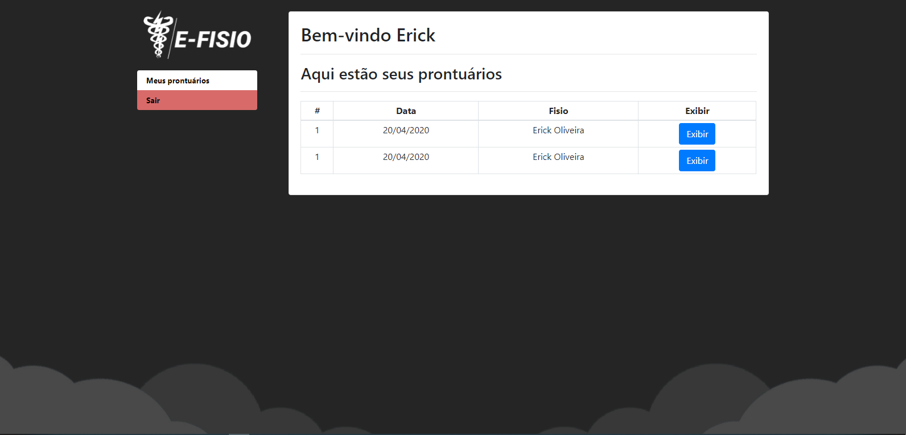

# E-FISIO

> Facilitando o gerenciamento de prontuários

 

## Sobre

e-fisio é uma maneira mais fácil e rápida para o gerencimento de prontuários fisioterapêuticos. 
Provendo segurança e acesso dos pacientes a consulta rápida de seus prontuários.

  
  
  
  

